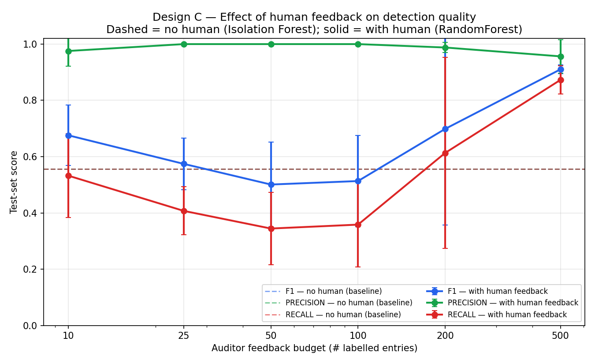

# Design C — Learning Curve

Same algorithm (RandomForest), same held-out test set (70 / 30 split,
stratified), evaluated against the full ground-truth label column.

| Budget | F1 (mean) | F1 (std) | Precision | Recall | Accuracy |
|---:|---:|---:|---:|---:|---:|
| 10 | 0.676 | 0.108 | 0.976 | 0.532 | 0.995 |
| 25 | 0.574 | 0.092 | 1.000 | 0.407 | 0.994 |
| 50 | 0.501 | 0.150 | 1.000 | 0.344 | 0.994 |
| 100 | 0.513 | 0.162 | 1.000 | 0.358 | 0.994 |
| 200 | 0.699 | 0.342 | 0.988 | 0.613 | 0.996 |
| 500 | 0.910 | 0.016 | 0.956 | 0.873 | 0.998 |

**Headline:** F1 climbs from **0.556** at 10 reviews
to **0.910** at 500 reviews — a gain of **+0.354**
attributable purely to additional auditor feedback, since the algorithm and
test set are held constant.

