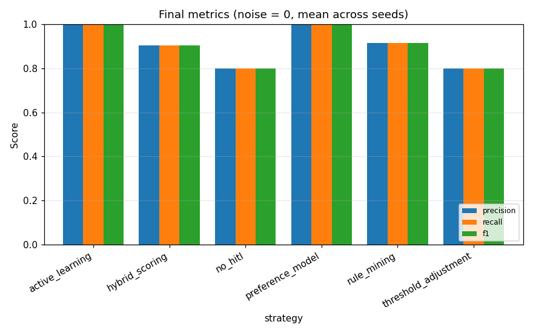
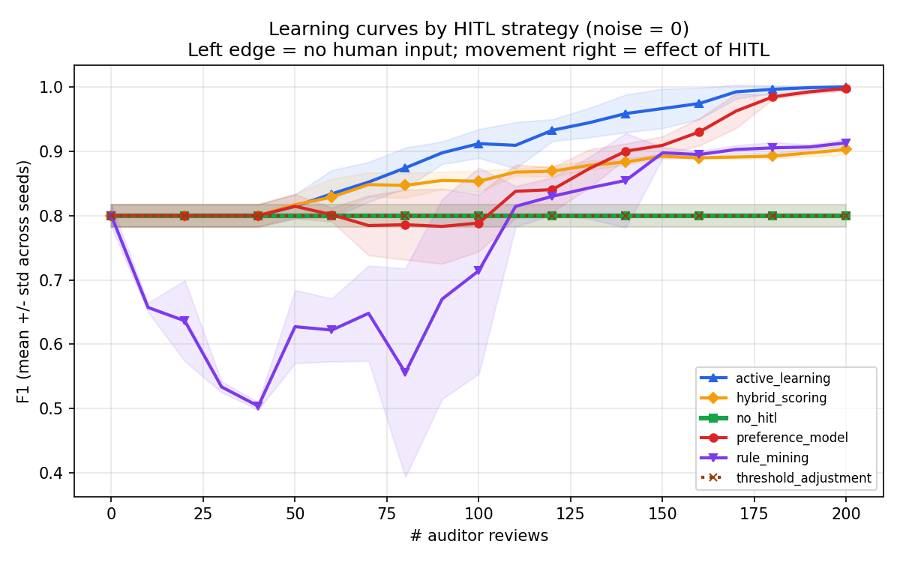
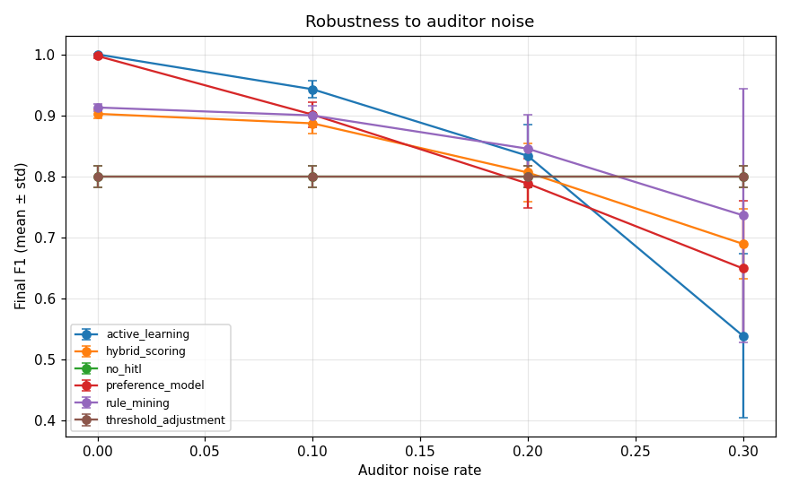
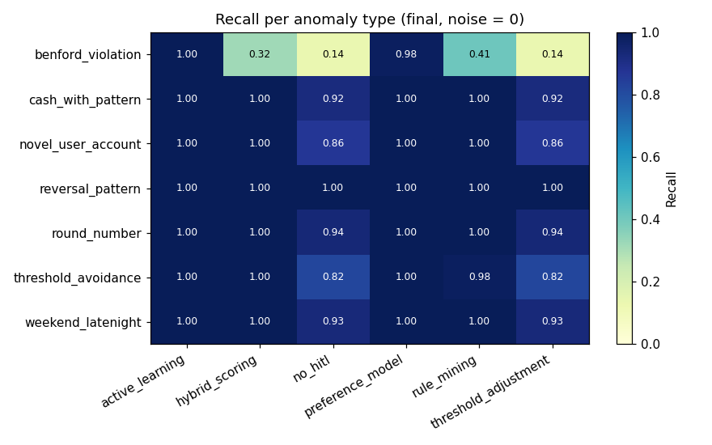

# HITL Anomaly Detection — Experimental Evaluation

_Auto-generated by `experiments/run_experiments.py`._

## 1. Setup

- **Dataset:** 1994 synthetic journal entries, 154 anomalies (7.7%)
- **Anomaly types injected:** 7 (benford_violation, round_number, cash_with_pattern, weekend_latenight, reversal_pattern, novel_user_account, threshold_avoidance)
- **Features (n=17):** amount, weekend, nwh, promptly, top_n, high_cash, marking, user_encoded, gl_account_encoded, leading_digit, second_digit, is_round_amount, just_below_threshold, benford_deviation, weekend_or_late, reversal_candidate, novel_user_account_combo
- **Strategies compared:** no_hitl, threshold_adjustment, preference_model, active_learning, hybrid_scoring, rule_mining
- **Seeds:** [0, 1, 2, 3, 4]
- **Review batch size:** 10, max reviews: 200
- **Auditor noise rates studied:** [0.0, 0.1, 0.2, 0.3]

## 2. Final performance (noise = 0)

Mean ± std over seeds; flagging top-K entries where K = # true anomalies.

```
                     precision        recall            f1           fpr       
                          mean    std   mean    std   mean    std   mean    std
strategy                                                                       
active_learning          1.000  0.000  1.000  0.000  1.000  0.000  0.000  0.000
hybrid_scoring           0.903  0.008  0.903  0.008  0.903  0.008  0.008  0.001
no_hitl                  0.800  0.017  0.800  0.017  0.800  0.017  0.017  0.001
preference_model         0.997  0.004  0.997  0.004  0.997  0.004  0.000  0.000
rule_mining              0.913  0.006  0.913  0.006  0.913  0.006  0.007  0.000
threshold_adjustment     0.800  0.017  0.800  0.017  0.800  0.017  0.017  0.001
```



## 3. Sample efficiency (learning curves)

How many auditor reviews each strategy needs to reach 95 % of its own peak F1, plus the F1 at 0 reviews (purely unsupervised baseline) and the peak.

```
            strategy  F1@0_reviews  F1@max  reviews_to_95%_of_max
     active_learning           0.8   1.000                    140
    preference_model           0.8   0.997                    170
         rule_mining           0.8   0.913                    150
      hybrid_scoring           0.8   0.903                    110
             no_hitl           0.8   0.800                      0
threshold_adjustment           0.8   0.800                      0
```



## 4. Robustness to auditor noise

Final F1 (mean across seeds) at each auditor noise rate:

```
noise_rate              0.0    0.1    0.2    0.3
strategy                                        
active_learning       1.000  0.943  0.834  0.539
hybrid_scoring        0.903  0.887  0.806  0.690
no_hitl               0.800  0.800  0.800  0.800
preference_model      0.997  0.901  0.788  0.649
rule_mining           0.913  0.900  0.845  0.736
threshold_adjustment  0.800  0.800  0.800  0.800
```



## 5. Per-anomaly-type recall

Which strategy catches which type best (final state, noise = 0):

```
strategy             active_learning  hybrid_scoring  no_hitl  preference_model  rule_mining  threshold_adjustment
anomaly_type                                                                                                      
benford_violation                1.0            0.32     0.14              0.98         0.41                  0.14
cash_with_pattern                1.0            1.00     0.92              1.00         1.00                  0.92
novel_user_account               1.0            1.00     0.86              1.00         1.00                  0.86
reversal_pattern                 1.0            1.00     1.00              1.00         1.00                  1.00
round_number                     1.0            1.00     0.94              1.00         1.00                  0.94
threshold_avoidance              1.0            1.00     0.82              1.00         0.98                  0.82
weekend_latenight                1.0            1.00     0.93              1.00         1.00                  0.93
```

Best strategy per type:

```
anomaly_type
benford_violation      active_learning
cash_with_pattern      active_learning
novel_user_account     active_learning
reversal_pattern       active_learning
round_number           active_learning
threshold_avoidance    active_learning
weekend_latenight      active_learning
```



## 6. Sample rules learned (rule_mining strategy)

```
BLACKLIST: IF high_cash=1 AND top_n=1 (support=35, purity=1.00)
BLACKLIST: IF marking=5 AND top_n=1 (support=29, purity=1.00)
BLACKLIST: IF nwh=1 AND top_n=1 (support=28, purity=1.00)
BLACKLIST: IF marking=6 AND top_n=1 (support=26, purity=1.00)
BLACKLIST: IF marking=2 AND top_n=1 (support=23, purity=1.00)
BLACKLIST: IF marking=5 AND user=Max (support=23, purity=1.00)
BLACKLIST: IF top_n=1 AND user=Bob (support=18, purity=1.00)
BLACKLIST: IF high_cash=1 AND marking=5 (support=15, purity=1.00)
```

## 7. Reproducibility

- Synthetic data is regenerated from a fixed seed via `src/utils/data_generator.py`. 
- All randomness flows from the seeds listed in §1; results above are mean ± std.
- Re-run: `python -m experiments.run_experiments --config experiments/configs/default.json`.

## 8. How to read the results

- **no_hitl** is the unsupervised baseline; HITL strategies must beat it.
- **threshold_adjustment** is cheap but only slides the cut-off — caps quickly.
- **preference_model** trains a fresh supervised classifier on each round of feedback.
- **active_learning** picks the *most-uncertain* entries to label, so it should reach high F1 fastest.
- **hybrid_scoring** blends the unsupervised and supervised signal with a feedback-driven α.
- **rule_mining** persists explicit human-readable rules — auditable but coarser.