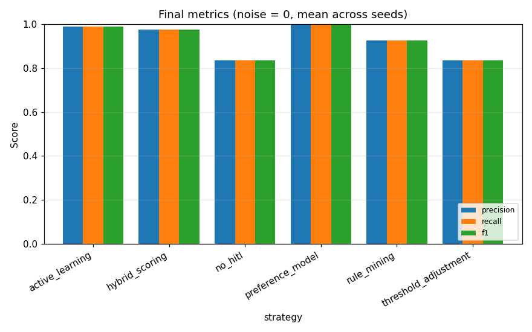
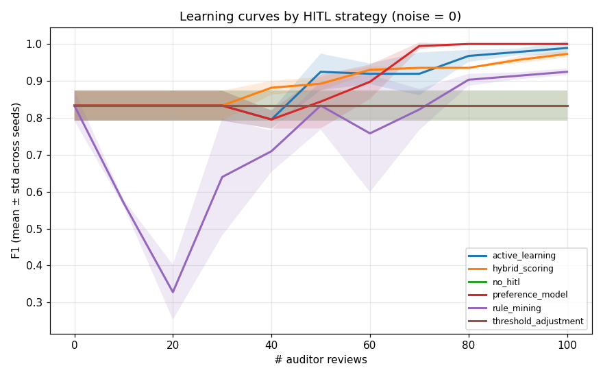
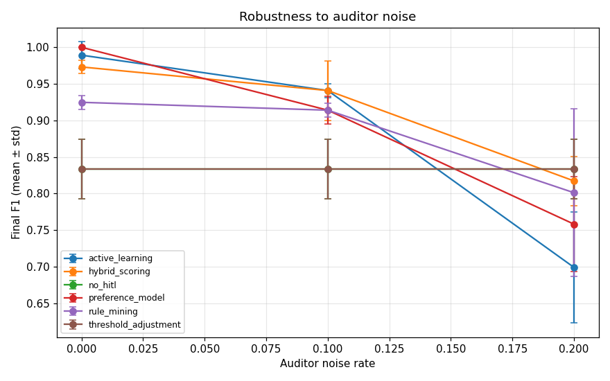
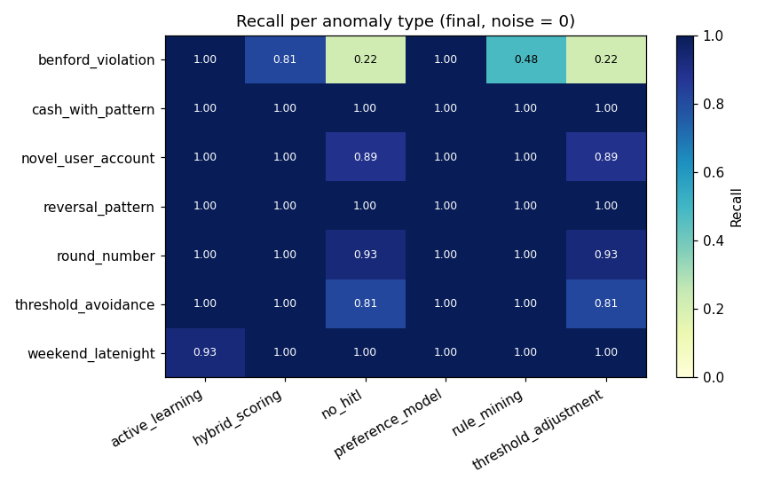

# HITL Anomaly Detection — Experimental Evaluation

_Auto-generated by `experiments/run_experiments.py`._

## 1. Setup

- **Dataset:** 798 synthetic journal entries, 62 anomalies (7.8%)
- **Anomaly types injected:** 7 (cash_with_pattern, benford_violation, novel_user_account, round_number, threshold_avoidance, weekend_latenight, reversal_pattern)
- **Features (n=17):** amount, weekend, nwh, promptly, top_n, high_cash, marking, user_encoded, gl_account_encoded, leading_digit, second_digit, is_round_amount, just_below_threshold, benford_deviation, weekend_or_late, reversal_candidate, novel_user_account_combo
- **Strategies compared:** no_hitl, threshold_adjustment, preference_model, active_learning, hybrid_scoring, rule_mining
- **Seeds:** [0, 1, 2]
- **Review batch size:** 10, max reviews: 100
- **Auditor noise rates studied:** [0.0, 0.1, 0.2]

## 2. Final performance (noise = 0)

Mean ± std over seeds; flagging top-K entries where K = # true anomalies.

```
                     precision        recall            f1           fpr       
                          mean    std   mean    std   mean    std   mean    std
strategy                                                                       
active_learning          0.989  0.019  0.989  0.019  0.989  0.019  0.001  0.002
hybrid_scoring           0.973  0.009  0.973  0.009  0.973  0.009  0.002  0.001
no_hitl                  0.833  0.041  0.833  0.041  0.833  0.041  0.014  0.003
preference_model         1.000  0.000  1.000  0.000  1.000  0.000  0.000  0.000
rule_mining              0.925  0.009  0.925  0.009  0.925  0.009  0.006  0.001
threshold_adjustment     0.833  0.041  0.833  0.041  0.833  0.041  0.014  0.003
```



## 3. Sample efficiency (learning curves)

How many auditor reviews are needed to reach F1 ≥ 0.70?

```
            strategy  reviews_to_F1_0.7   max_f1
     active_learning                  0 0.989247
      hybrid_scoring                  0 0.973118
             no_hitl                  0 0.833333
    preference_model                  0 1.000000
         rule_mining                  0 0.924731
threshold_adjustment                  0 0.833333
```



## 4. Robustness to auditor noise

Final F1 (mean across seeds) at each auditor noise rate:

```
noise_rate              0.0    0.1    0.2
strategy                                 
active_learning       0.989  0.941  0.699
hybrid_scoring        0.973  0.941  0.817
no_hitl               0.833  0.833  0.833
preference_model      1.000  0.914  0.758
rule_mining           0.925  0.914  0.801
threshold_adjustment  0.833  0.833  0.833
```



## 5. Per-anomaly-type recall

Which strategy catches which type best (final state, noise = 0):

```
strategy             active_learning  hybrid_scoring  no_hitl  preference_model  rule_mining  threshold_adjustment
anomaly_type                                                                                                      
benford_violation               1.00            0.81     0.22               1.0         0.48                  0.22
cash_with_pattern               1.00            1.00     1.00               1.0         1.00                  1.00
novel_user_account              1.00            1.00     0.89               1.0         1.00                  0.89
reversal_pattern                1.00            1.00     1.00               1.0         1.00                  1.00
round_number                    1.00            1.00     0.93               1.0         1.00                  0.93
threshold_avoidance             1.00            1.00     0.81               1.0         1.00                  0.81
weekend_latenight               0.93            1.00     1.00               1.0         1.00                  1.00
```

Best strategy per type:

```
anomaly_type
benford_violation      active_learning
cash_with_pattern      active_learning
novel_user_account     active_learning
reversal_pattern       active_learning
round_number           active_learning
threshold_avoidance    active_learning
weekend_latenight       hybrid_scoring
```



## 6. Sample rules learned (rule_mining strategy)

```
WHITELIST: IF marking=0 (support=11, purity=1.00)
BLACKLIST: IF marking=5 AND top_n=1 (support=11, purity=1.00)
BLACKLIST: IF marking=6 AND top_n=1 (support=11, purity=1.00)
BLACKLIST: IF nwh=1 AND marking=4 (support=10, purity=1.00)
WHITELIST: IF promptly=1 AND marking=0 (support=10, purity=1.00)
WHITELIST: IF weekend=0 AND marking=0 (support=9, purity=1.00)
BLACKLIST: IF marking=2 AND top_n=1 (support=9, purity=1.00)
BLACKLIST: IF marking=5 AND user=Max (support=9, purity=1.00)
```

## 7. Reproducibility

- Synthetic data is regenerated from a fixed seed via `src/utils/data_generator.py`. 
- All randomness flows from the seeds listed in §1; results above are mean ± std.
- Re-run: `python -m experiments.run_experiments --config experiments/configs/default.json`.

## 8. How to read the results

- **no_hitl** is the unsupervised baseline; HITL strategies must beat it.
- **threshold_adjustment** is cheap but only slides the cut-off — caps quickly.
- **preference_model** trains a fresh supervised classifier on each round of feedback.
- **active_learning** picks the *most-uncertain* entries to label, so it should reach high F1 fastest.
- **hybrid_scoring** blends the unsupervised and supervised signal with a feedback-driven α.
- **rule_mining** persists explicit human-readable rules — auditable but coarser.