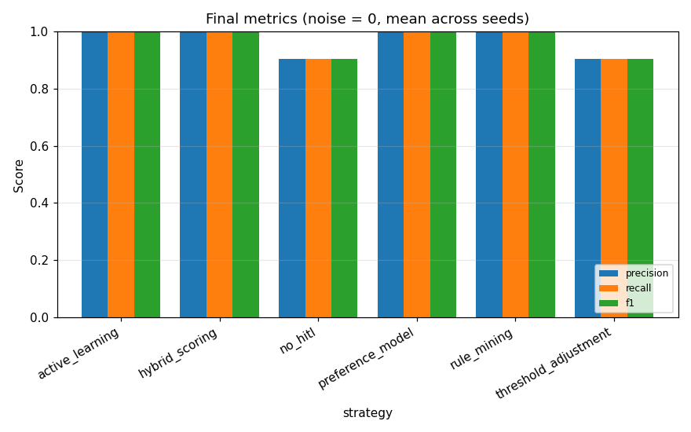
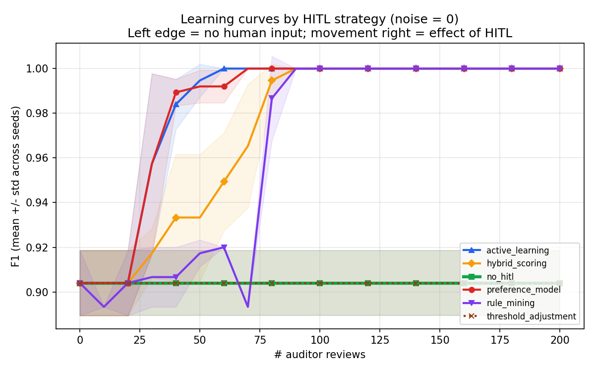
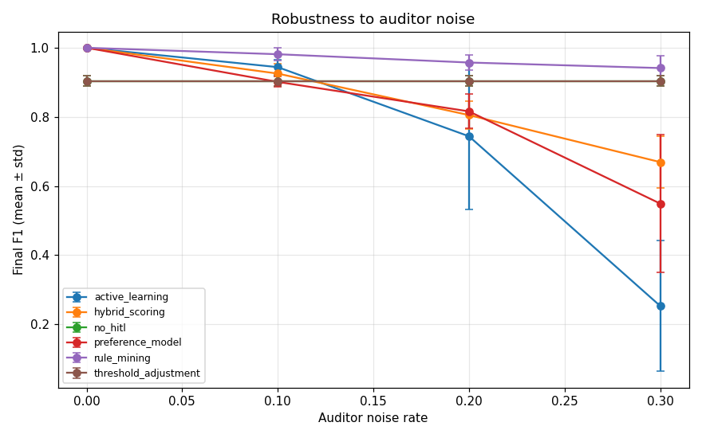
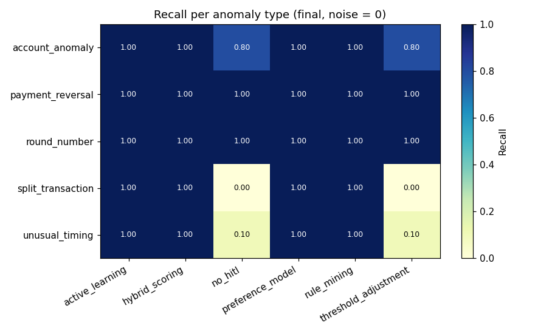

# HITL Anomaly Detection — Experimental Evaluation

_Auto-generated by `experiments/run_experiments.py`._

## 1. Setup

- **Dataset:** real CSV (journal_entries_final7_1.csv, subsample of 8000) journal entries, 75 anomalies (0.9%)
- **Anomaly types injected:** 5 (payment_reversal, split_transaction, unusual_timing, account_anomaly, round_number)
- **Features (n=17):** amount, weekend, nwh, promptly, top_n, high_cash, marking, user_encoded, gl_account_encoded, leading_digit, second_digit, is_round_amount, just_below_threshold, benford_deviation, weekend_or_late, reversal_candidate, novel_user_account_combo
- **Strategies compared:** no_hitl, threshold_adjustment, preference_model, active_learning, hybrid_scoring, rule_mining
- **Seeds:** [0, 1, 2, 3, 4]
- **Review batch size:** 10, max reviews: 200
- **Auditor noise rates studied:** [0.0, 0.1, 0.2, 0.3]

## 2. Final performance (noise = 0)

Mean ± std over seeds; flagging top-K entries where K = # true anomalies.

```
                     precision        recall            f1           fpr     
                          mean    std   mean    std   mean    std   mean  std
strategy                                                                     
active_learning          1.000  0.000  1.000  0.000  1.000  0.000  0.000  0.0
hybrid_scoring           1.000  0.000  1.000  0.000  1.000  0.000  0.000  0.0
no_hitl                  0.904  0.015  0.904  0.015  0.904  0.015  0.001  0.0
preference_model         1.000  0.000  1.000  0.000  1.000  0.000  0.000  0.0
rule_mining              1.000  0.000  1.000  0.000  1.000  0.000  0.000  0.0
threshold_adjustment     0.904  0.015  0.904  0.015  0.904  0.015  0.001  0.0
```



## 3. Sample efficiency (learning curves)

How many auditor reviews each strategy needs to reach 95 % of its own peak F1, plus the F1 at 0 reviews (purely unsupervised baseline) and the peak.

```
            strategy  F1@0_reviews  F1@max  reviews_to_95%_of_max
     active_learning         0.904   1.000                     30
      hybrid_scoring         0.904   1.000                     70
    preference_model         0.904   1.000                     30
         rule_mining         0.904   1.000                     80
             no_hitl         0.904   0.904                      0
threshold_adjustment         0.904   0.904                      0
```



## 4. Robustness to auditor noise

Final F1 (mean across seeds) at each auditor noise rate:

```
noise_rate              0.0    0.1    0.2    0.3
strategy                                        
active_learning       1.000  0.944  0.744  0.253
hybrid_scoring        1.000  0.925  0.805  0.669
no_hitl               0.904  0.904  0.904  0.904
preference_model      1.000  0.901  0.816  0.549
rule_mining           1.000  0.981  0.957  0.941
threshold_adjustment  0.904  0.904  0.904  0.904
```



## 5. Per-anomaly-type recall

Which strategy catches which type best (final state, noise = 0):

```
strategy           active_learning  hybrid_scoring  no_hitl  preference_model  rule_mining  threshold_adjustment
anomaly_type                                                                                                    
account_anomaly                1.0             1.0      0.8               1.0          1.0                   0.8
payment_reversal               1.0             1.0      1.0               1.0          1.0                   1.0
round_number                   1.0             1.0      1.0               1.0          1.0                   1.0
split_transaction              1.0             1.0      0.0               1.0          1.0                   0.0
unusual_timing                 1.0             1.0      0.1               1.0          1.0                   0.1
```

Best strategy per type:

```
anomaly_type
account_anomaly      active_learning
payment_reversal     active_learning
round_number         active_learning
split_transaction    active_learning
unusual_timing       active_learning
```



## 6. Sample rules learned (rule_mining strategy)

```
WHITELIST: IF marking=0 (support=125, purity=1.00)
WHITELIST: IF promptly=1 AND marking=0 (support=115, purity=1.00)
WHITELIST: IF nwh=0 AND marking=0 (support=104, purity=1.00)
WHITELIST: IF high_cash=0 (support=102, purity=1.00)
WHITELIST: IF high_cash=0 AND marking=0 (support=102, purity=1.00)
WHITELIST: IF promptly=1 AND high_cash=0 (support=92, purity=1.00)
WHITELIST: IF marking=0 AND top_n=0 (support=85, purity=1.00)
WHITELIST: IF nwh=0 AND high_cash=0 (support=81, purity=1.00)
```

## 7. Reproducibility

- Data source: real journal-entry CSV `journal_entries_final7_1.csv` (subsampled to 8000 rows preserving label balance, seed 42).
- All randomness flows from the seeds listed in §1; results above are mean ± std.
- Re-run: `python -m experiments.run_experiments --config experiments/configs/default.json`.

## 8. How to read the results

- **no_hitl** is the unsupervised baseline; HITL strategies must beat it.
- **threshold_adjustment** is cheap but only slides the cut-off — caps quickly.
- **preference_model** trains a fresh supervised classifier on each round of feedback.
- **active_learning** picks the *most-uncertain* entries to label, so it should reach high F1 fastest.
- **hybrid_scoring** blends the unsupervised and supervised signal with a feedback-driven α.
- **rule_mining** persists explicit human-readable rules — auditable but coarser.