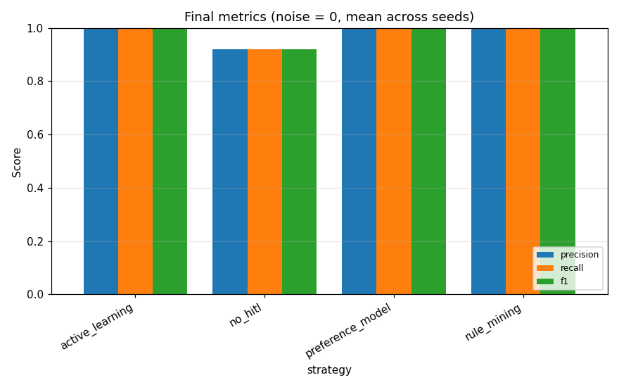
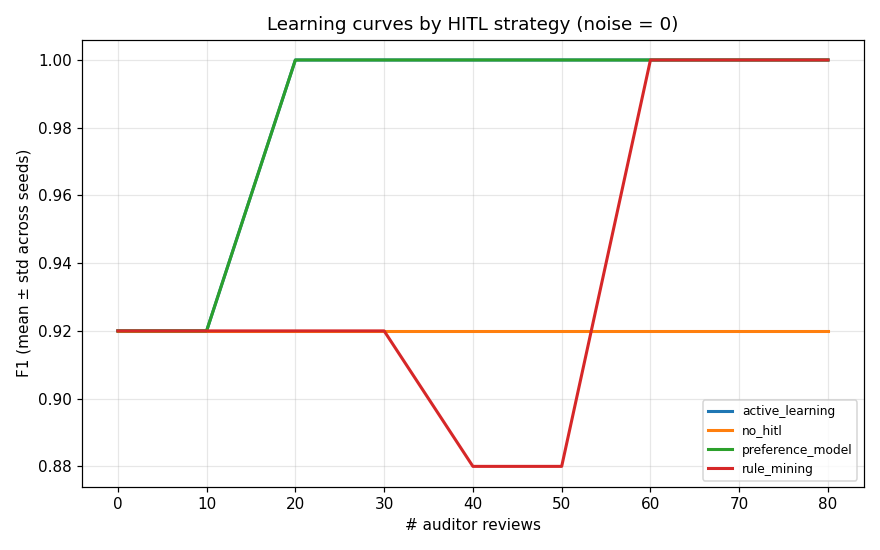
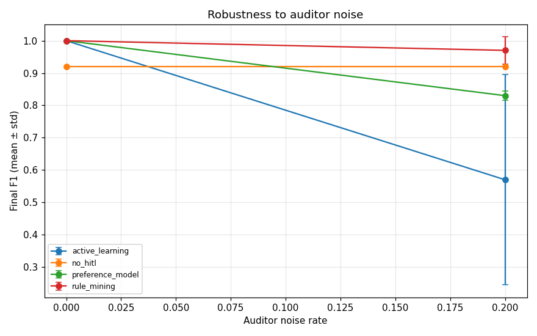
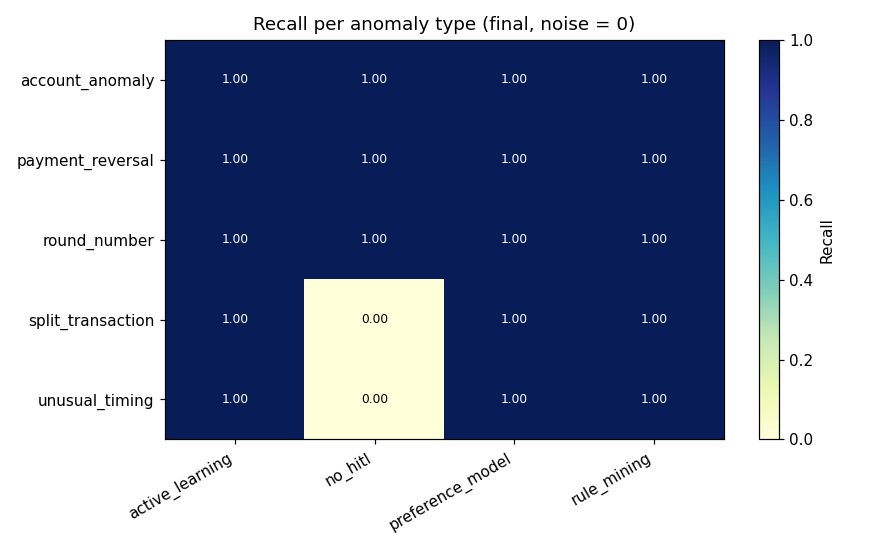

# HITL Anomaly Detection — Experimental Evaluation

_Auto-generated by `experiments/run_experiments.py`._

## 1. Setup

- **Dataset:** 3000 synthetic journal entries, 50 anomalies (1.7%)
- **Anomaly types injected:** 5 (payment_reversal, unusual_timing, round_number, account_anomaly, split_transaction)
- **Features (n=17):** amount, weekend, nwh, promptly, top_n, high_cash, marking, user_encoded, gl_account_encoded, leading_digit, second_digit, is_round_amount, just_below_threshold, benford_deviation, weekend_or_late, reversal_candidate, novel_user_account_combo
- **Strategies compared:** no_hitl, preference_model, active_learning, rule_mining
- **Seeds:** [0, 1]
- **Review batch size:** 10, max reviews: 80
- **Auditor noise rates studied:** [0.0, 0.2]

## 2. Final performance (noise = 0)

Mean ± std over seeds; flagging top-K entries where K = # true anomalies.

```
                 precision      recall         f1         fpr     
                      mean  std   mean  std  mean  std   mean  std
strategy                                                          
active_learning       1.00  0.0   1.00  0.0  1.00  0.0  0.000  0.0
no_hitl               0.92  0.0   0.92  0.0  0.92  0.0  0.001  0.0
preference_model      1.00  0.0   1.00  0.0  1.00  0.0  0.000  0.0
rule_mining           1.00  0.0   1.00  0.0  1.00  0.0  0.000  0.0
```



## 3. Sample efficiency (learning curves)

How many auditor reviews each strategy needs to reach 95 % of its own peak F1, plus the F1 at 0 reviews (purely unsupervised baseline) and the peak.

```
        strategy  F1@0_reviews  F1@max  reviews_to_95%_of_max
 active_learning          0.92    1.00                     20
preference_model          0.92    1.00                     20
     rule_mining          0.92    1.00                     60
         no_hitl          0.92    0.92                      0
```



## 4. Robustness to auditor noise

Final F1 (mean across seeds) at each auditor noise rate:

```
noise_rate         0.0   0.2
strategy                    
active_learning   1.00  0.57
no_hitl           0.92  0.92
preference_model  1.00  0.83
rule_mining       1.00  0.97
```



## 5. Per-anomaly-type recall

Which strategy catches which type best (final state, noise = 0):

```
strategy           active_learning  no_hitl  preference_model  rule_mining
anomaly_type                                                              
account_anomaly                1.0      1.0               1.0          1.0
payment_reversal               1.0      1.0               1.0          1.0
round_number                   1.0      1.0               1.0          1.0
split_transaction              1.0      0.0               1.0          1.0
unusual_timing                 1.0      0.0               1.0          1.0
```

Best strategy per type:

```
anomaly_type
account_anomaly      active_learning
payment_reversal     active_learning
round_number         active_learning
split_transaction    active_learning
unusual_timing       active_learning
```



## 6. Sample rules learned (rule_mining strategy)

```
BLACKLIST: IF user=Fred (support=46, purity=1.00)
BLACKLIST: IF high_cash=1 AND user=Fred (support=46, purity=1.00)
BLACKLIST: IF nwh=0 AND user=Fred (support=45, purity=1.00)
BLACKLIST: IF promptly=1 AND user=Fred (support=45, purity=1.00)
BLACKLIST: IF marking=6 (support=44, purity=1.00)
BLACKLIST: IF nwh=0 AND marking=6 (support=44, purity=1.00)
BLACKLIST: IF promptly=1 AND marking=6 (support=44, purity=1.00)
BLACKLIST: IF high_cash=1 AND marking=6 (support=44, purity=1.00)
```

## 7. Reproducibility

- Synthetic data is regenerated from a fixed seed via `src/utils/data_generator.py`. 
- All randomness flows from the seeds listed in §1; results above are mean ± std.
- Re-run: `python -m experiments.run_experiments --config experiments/configs/default.json`.

## 8. How to read the results

- **no_hitl** is the unsupervised baseline; HITL strategies must beat it.
- **threshold_adjustment** is cheap but only slides the cut-off — caps quickly.
- **preference_model** trains a fresh supervised classifier on each round of feedback.
- **active_learning** picks the *most-uncertain* entries to label, so it should reach high F1 fastest.
- **hybrid_scoring** blends the unsupervised and supervised signal with a feedback-driven α.
- **rule_mining** persists explicit human-readable rules — auditable but coarser.